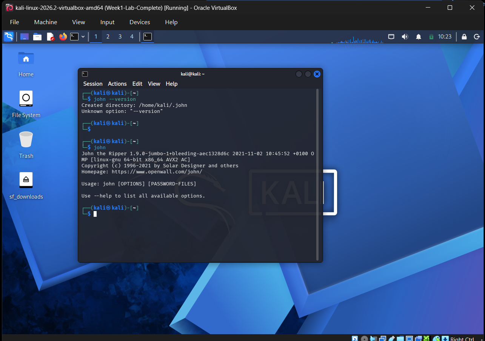
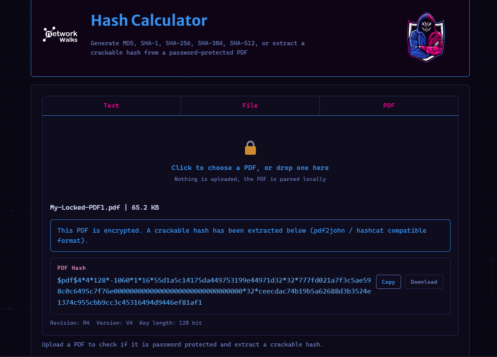
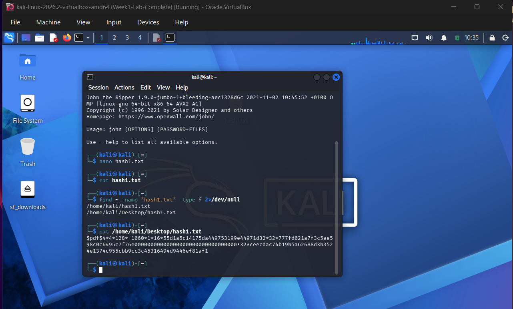
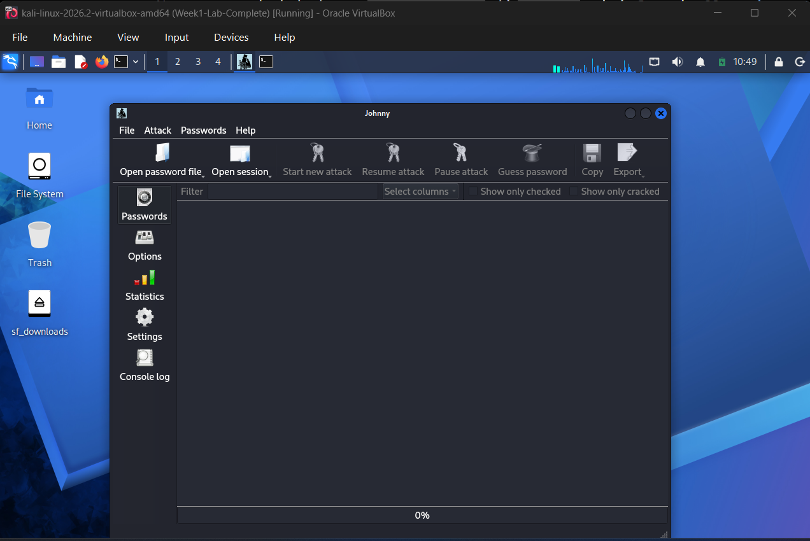
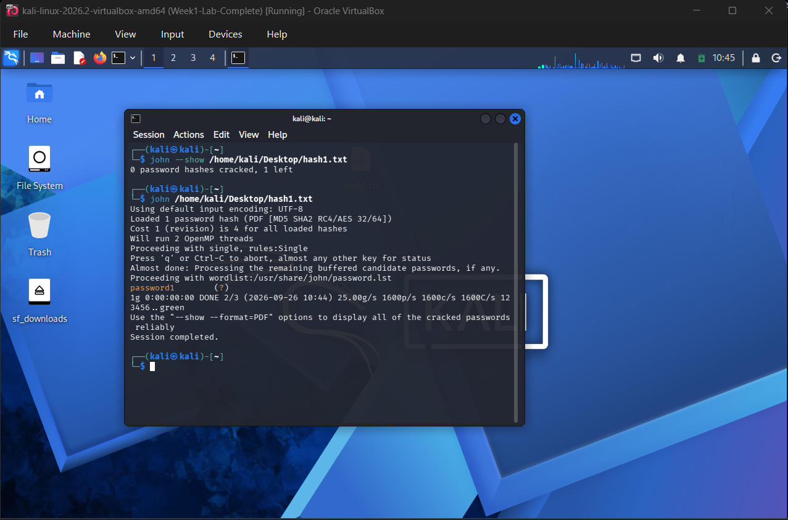
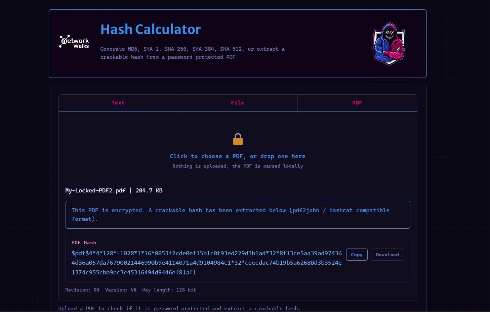
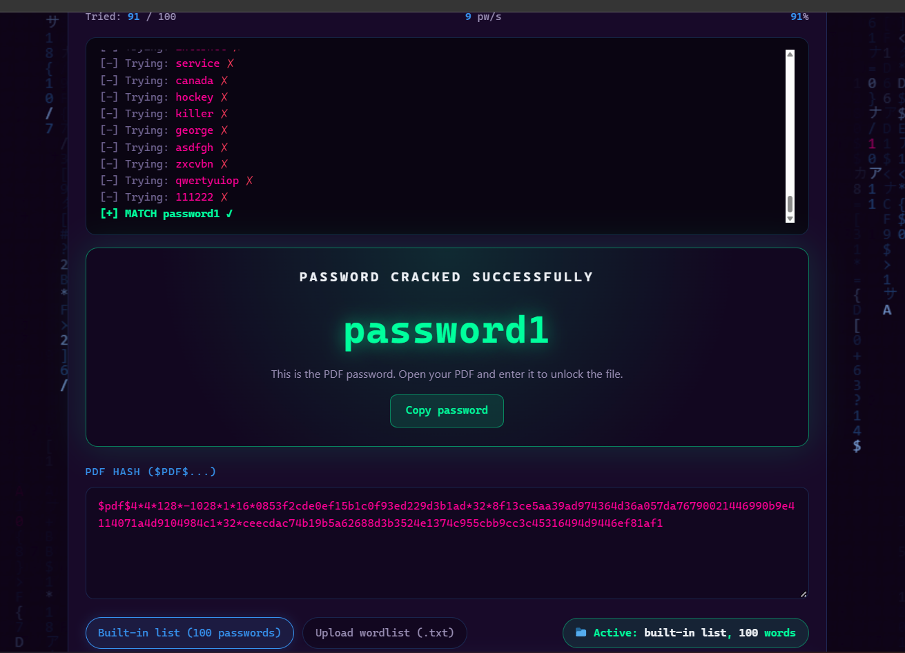
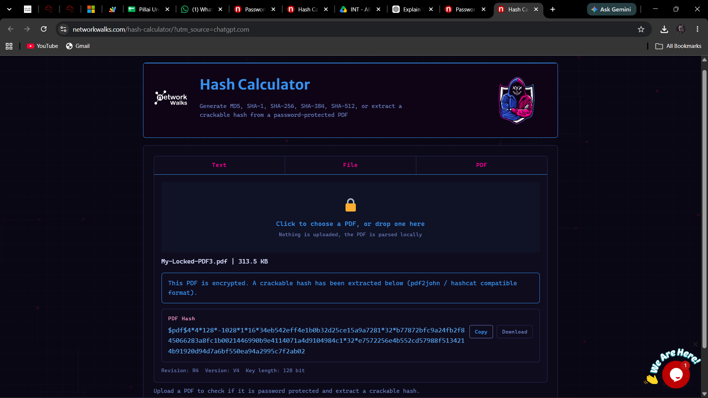
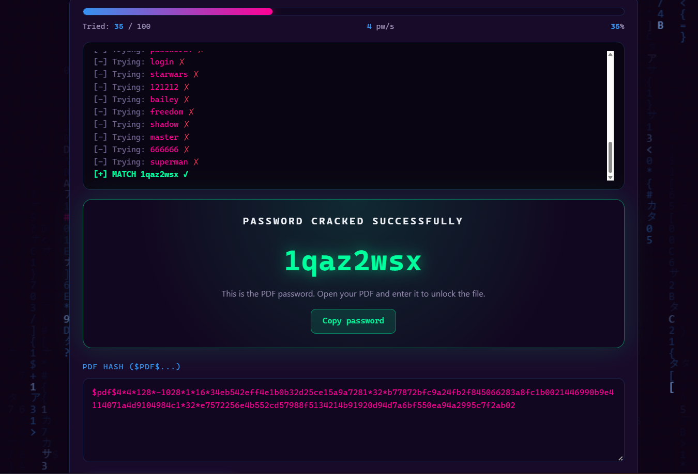

# Networkwalks — Week 3 Cybersecurity Internship

## Cybersecurity Internship — Week 3

This repository contains my completed **Week 3 practical cybersecurity lab work** as part of my internship at **Networkwalks**.

The week focused on practical password-cracking techniques using **John the Ripper**, PDF hash extraction, and Networkwalks' online password-cracking tools.

### Modules Completed

- **Module 1 — Password Cracking with John the Ripper**
- **Module 2 — Password Cracking with Networkwalks Tools**
- **Additional Practice — Locked PDF 3**

---

# Module 1 — Password Cracking with John the Ripper

## Objective

The objective of this module was to understand the process of extracting a crackable hash from a locked PDF, preparing the hash for John the Ripper, loading the hash using the John the Ripper command-line tool, recovering the password, and using the recovered password to open the protected PDF.

The PDF used for this module was:

```text
My-Locked-PDF1.pdf
```

Step 1 — Verify John the Ripper

John the Ripper was executed in Kali Linux to verify that the tool was installed and available for password-cracking operations.

Command
john




Step 2 — Extract PDF Hash

The locked PDF was processed to obtain a crackable PDF hash.

The extracted hash began with:

$pdf$

The extracted hash was used as the input for John the Ripper.





Step 3 — Create hash1.txt

The extracted PDF hash was saved into a text file named:

hash1.txt

The file contained the complete $pdf$... hash required by John the Ripper.





Step 4 — John the Ripper Hash Loading

The hash1.txt file was supplied to John the Ripper through the Kali Linux terminal.

John successfully recognized the PDF hash format and loaded the password hash.

Command
john /home/kali/Desktop/hash1.txt





Step 5 — Password Cracking

John the Ripper successfully processed the PDF password hash.

The recovered password was:

password1

The cracking session completed successfully.





Step 6 — Open the Protected PDF

The recovered password was used to open the protected PDF:

My-Locked-PDF1.pdf

The PDF opened successfully and the contents/flag were visible.


# Module 2 — Password Cracking with Networkwalks Tools

## Objective

The objective of this module was to use Networkwalks' online tools to extract a crackable PDF hash and recover the password using the provided Password Cracker.

The PDF used for this module was:

My-Locked-PDF2.pdf


The workflow consisted of:

Locked PDF
     ↓
Networkwalks Hash Calculator
     ↓
PDF Hash
     ↓
Networkwalks Password Cracker
     ↓
Recovered Password
     ↓
Unlocked PDF


Step 1 — PDF Hash Extraction


The locked PDF was uploaded to the Networkwalks Hash Calculator.

The tool generated a crackable PDF hash beginning with:

$pdf$




Step 2 — Password Cracking


The extracted PDF hash was submitted to the Networkwalks Password Cracker.

The tool successfully recovered the password:

password1




Step 3 — Open the Protected PDF


The recovered password was used to open:

My-Locked-PDF2.pdf

The PDF opened successfully and the contents/flag were visible.


Additional Practice — Locked PDF 3

After completing the two required modules, an additional locked PDF was tested as extra practice.

The same Networkwalks workflow was followed:

PDF3
 ↓
Hash Calculator
 ↓
PDF Hash
 ↓
Password Cracker
 ↓
Recovered Password
 ↓
Unlocked PDF


This additional activity was performed for further practical experience and is separate from the two required modules.


Step 1 — PDF3 Hash Extraction


The third locked PDF was uploaded to the Networkwalks Hash Calculator and a crackable PDF hash was generated.




Step 2 — PDF3 Password Cracking


The extracted hash was submitted to the Networkwalks Password Cracker.

The password was successfully recovered.




Step 3 — Open PDF3


The recovered password was used to open the third protected PDF.

The PDF opened successfully and the contents/flag were visible.


# Tools Used

## Module 1 — John the Ripper

- Kali Linux
- John the Ripper
- Terminal
- PDF Hash Extraction
- `hash1.txt`

## Module 2 — Networkwalks Password Cracker

- Networkwalks Hash Calculator
- Networkwalks Password Cracker
- PDF Password Recovery

## Additional Practice — PDF3

- Networkwalks Hash Calculator
- Networkwalks Password Cracker
- PDF Password Recovery


# Skills Practiced

Through these practical exercises, I gained hands-on experience with:

- Password cracking fundamentals
- PDF password hash extraction
- Hash file preparation
- John the Ripper
- Command-line password cracking
- Password hash identification
- Wordlist-based password cracking
- Online hash calculation
- Password-cracking workflows
- Working with encrypted PDF files
- Password recovery and verification
- Kali Linux command-line tools
- Practical cybersecurity lab documentation


# Practical Workflow

The overall workflow practiced during Week 3 can be summarized as:

```text
Identify Protected PDF
        ↓
Extract Crackable Hash
        ↓
Prepare Hash
        ↓
Load Hash into Cracking Tool
        ↓
Perform Password Cracking
        ↓
Recover Password
        ↓
Verify Password
        ↓
Open Protected PDF
```


# Evidence

All screenshots from the Week 3 practical work are stored together in the `Screenshots` folder.

## Module 1 — John the Ripper

**Screenshots 01–06**

Evidence includes:

- John the Ripper setup
- PDF hash extraction
- Hash file preparation
- Hash loading
- Password cracking
- Successfully unlocked PDF

---

## Module 2 — Networkwalks Password Cracker

**Screenshots 07–09**

Evidence includes:

- PDF2 hash extraction
- Password cracking using the Networkwalks Password Cracker
- Successfully unlocked PDF2

---

## Additional Practice — PDF3

**Screenshots 10–12**

Evidence includes:

- PDF3 hash extraction
- Password cracking using the Networkwalks Password Cracker
- Successfully unlocked PDF3

The screenshot numbering is continuous across the complete Week 3 submission so that all practical evidence can be reviewed together.


# Conclusion

Week 3 provided hands-on practice with practical **PDF password-cracking workflows** using both **John the Ripper** and **Networkwalks' online tools**.

The practical exercises involved extracting PDF hashes, preparing and loading hashes, performing password-cracking operations, recovering passwords, and verifying the recovered passwords by successfully opening protected PDF files.

The additional PDF3 exercise provided further practice with the same workflow and helped reinforce the concepts covered during the required modules.


# Week 3 Submission Summary

| Section | Evidence |
|---|---|
| **Module 1 — John the Ripper** | Screenshots 01–06 |
| **Module 2 — Networkwalks Tools** | Screenshots 07–09 |
| **Additional Practice — PDF3** | Screenshots 10–12 |
| **Total Screenshots** | **12** |

---

## Week 3 Internship Submission

**Networkwalks Cybersecurity Internship**

**Practical Cybersecurity Lab — Week 3**
Total Screenshots	12

